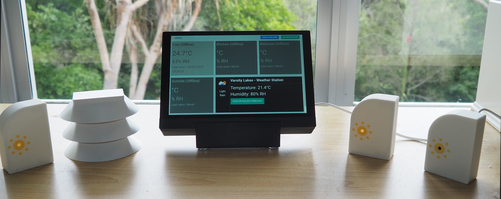

# Ethos Project

## Overview

This site hosts the documentation for the heat early warning system developed by the [Ethos Project](https://www.griffith.edu.au/research/climate-action/climate-transitions/health/ethos-project) at [Griffith University](https://www.griffith.edu.au/) with funding provided by the [Wellcome Trust](https://wellcome.org/) (grant 224709/Z/21/Z: 'Individualised heat-health early warning systems: A novel digital solution', held by S. Rutherford, A. J. E. Bach, S. Binnewies).

The Ethos Project aims to provide a heat Early Warning System (EWS) for vulnerable populations, such as older adults. It achieves this through real-time monitoring of ambient conditions (ambient temperature and relative humidity) using sensors placed around a user's place of residence. These sensors then transmit that information to a base station which then processes and displays that data as well as forwards it to the server. There is also an optional smartphone app developed by the Griffith App Factory which can act as an alternative User Interface (UI) to the base station by connecting to the server.

*Photo of the Ethos system. From left to right: indoor sensor, outdoor sensor, base station, indoor sensor x2.*

## Architecture

The project is largely comprised of three main components:

1. Ethos Base Station - This is the heart of the system and is responsible for: receiving transmitted sensor information, processing that information to calculate risk based on user information and forwarding the sensor/risk information to the server.
2. Ethos Temperature Sensor(s) - These are the individual sensors which read the ambient temperature and relative humidity and transmit that information to the base station using radio communication.
3. Ethos Server - This receives and stores the user's temperature/humidity data in a database. It is also responsible for sending surveys during heatwaves, as well as storing the survey answers. All stored data is de-identified.

``` mermaid
graph TD
    %% External Elements
    twilio[Twilio]

    %% Ethos-temperature-sensor
    subgraph ETS [Ethos-temperature-sensor]
        direction TB
        sht45[("SHT45 Sensor")]
        feather_m0["Feather M0 Board<br>(feather_m0.ino)"]
        radio_tx["RFM95 TX Module<br>(radio.cpp)"]

        sht45 -- Temperature/Humidity --> feather_m0
        feather_m0 -- Controls & Reads --> radio_tx
    end

    %% Ethos-base-station
    subgraph EBS [Ethos-base-station]
        direction TB
        bs_python_radio["Python Radio Receiver<br>(python_radio)"]
        bs_js_ui["JavaScript UI<br>(javascript_ui)"]

        bs_python_radio -- "Heat Risk Data<br>(WebSockets)" --> bs_js_ui
    end

    %% Ethos-server (Dockerized)
    subgraph ES [Ethos-server]
        direction TB
        srv_nginx["Nginx<br>(Reverse Proxy, SSL Termination)"]
        srv_certbot["Certbot<br>(SSL Certificates)"]
        srv_couchdb[("CouchDB<br>(Database)")]
        srv_nodejs["Node.js Server<br>(Survey Logic, Notifications)"]
        srv_redis[("Redis<br>(Survey Flags)")]

        srv_certbot -.-> srv_nginx
        srv_nginx <--> srv_couchdb
        srv_nginx <--> srv_nodejs
        srv_nodejs <--> srv_redis
    end

    %% Ethos-smartphone-app (Optional)
    subgraph EApp ["User's smartphone"]
        direction TB
        app_ui["Ethos iOS/Android App UI"]
    end

    %% Connections
    radio_tx -- "Sensor Data via RFM95" --> bs_python_radio

    bs_js_ui <-- "HTTPS" --> srv_nginx

    srv_nodejs -- "HTTPS" --> twilio
    twilio -- "Push/SMS Notifications" --> EApp

    app_ui <-- "HTTPS" --> srv_nginx

    %% Styling (Optional - for better visual distinction if supported well)
    classDef sensor fill:#f9f,stroke:#333,stroke-width:2px;
    classDef basestation fill:#ccf,stroke:#333,stroke-width:2px;
    classDef server_component fill:#9cf,stroke:#333,stroke-width:2px;
    classDef app fill:#lightgreen,stroke:#333,stroke-width:2px;
    classDef external fill:#eee,stroke:#333,stroke-width:2px;

    class ETS,sht45,feather_m0,radio_tx sensor;
    class EBS,bs_python_radio,bs_js_ui basestation;
    class ES,srv_nginx,srv_certbot,srv_couchdb,srv_nodejs,srv_redis server_component;
    class EApp,app_ui app;
```

## Hardware

TODO
